## Build Jenkins Pipelines
This repository provides the project description for the deployment of a static website on S3 AWS using the Jenkins Pipeline.
The files in this repository contain a simple index.html file for testing the linting stage and the final upload. 
The main file is the Jenkinsfile, containing the configuration settings for a simple build pipeline and deployment.

### Dependencies
##### 1. AWS account

#### 2. Jenkins

## Prerequisite
1. AWS account with a user (non root) having restricted permission
1. create an ec2 instance, install and configure Jenkins running on it
1. modify the "Jenkinsfile" in order to include linting, security check, and upload to AWS 

### Screenshots 

1. The AWS console with the permissions being created

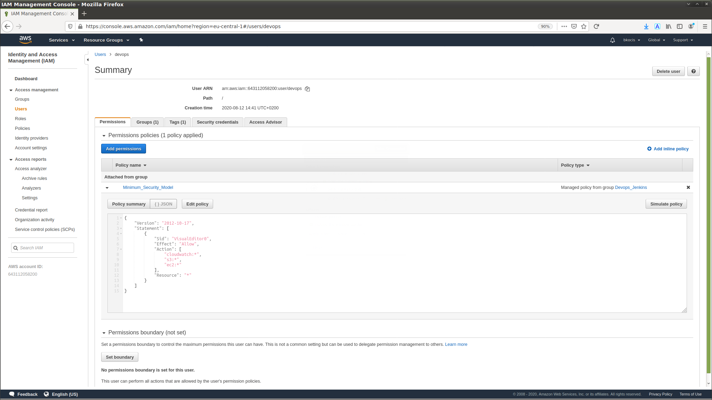

2. The unique AWS URL of your EC2

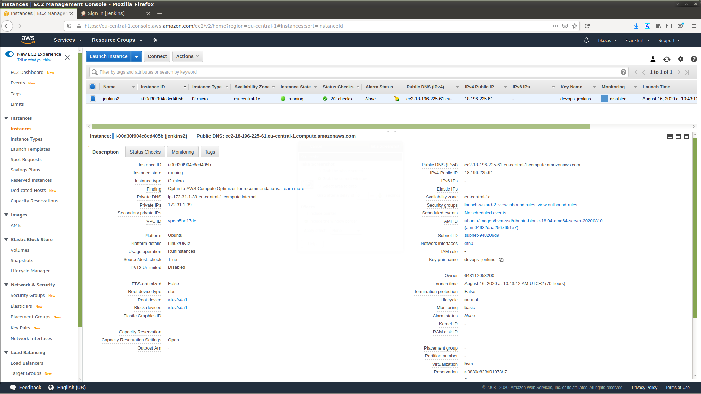

3. Jenkins running on unique AWS URL 

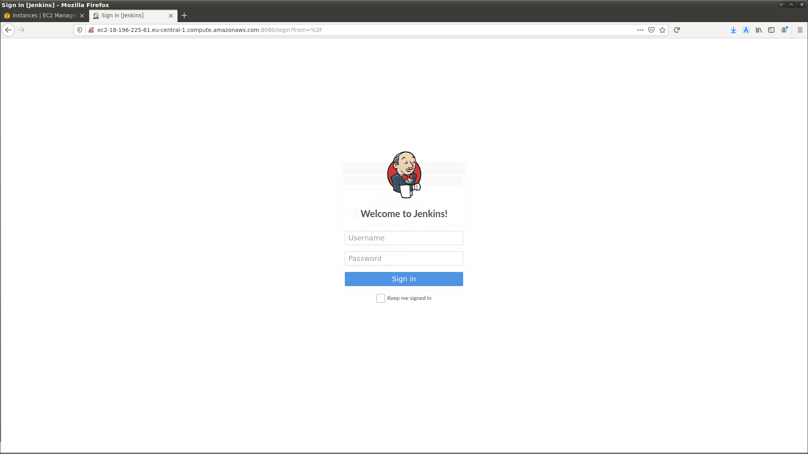

4. AWS urlr with the Blue Ocean link in the sidebar

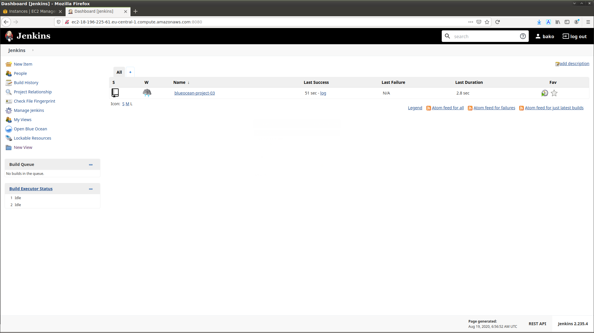

5. GitHub project as a pipeline - master branch 

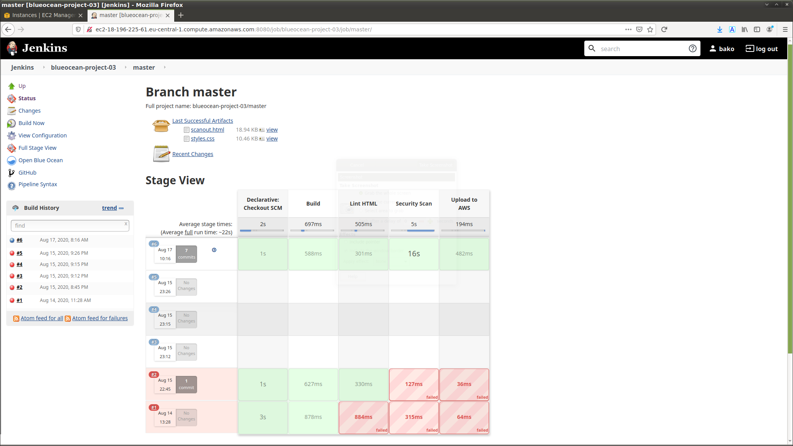

5. GitHub project as a pipeline - multibranch/stage pipeline as in BlueOcean

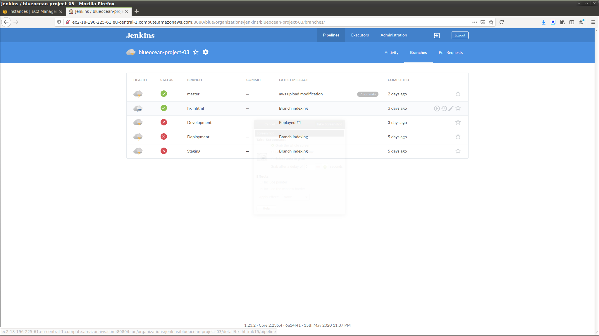

5. GitHub project as a pipeline - master brach pipeline successful build 

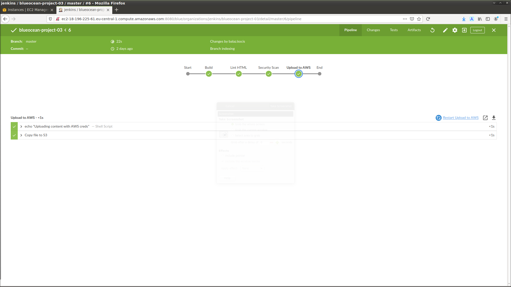

6. AWS link to S3 with the index.html file 

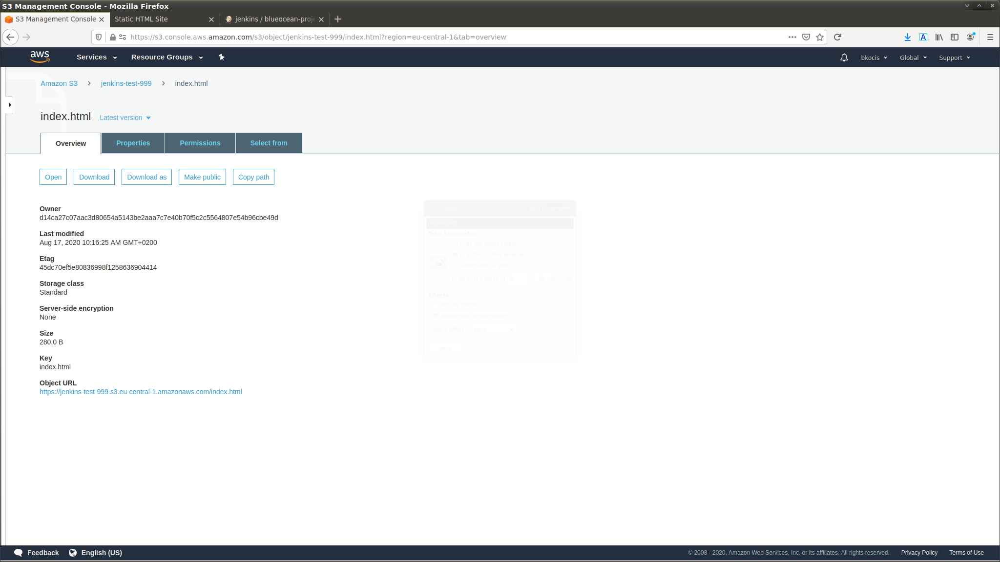

6. rendering of the index.html from the S3 

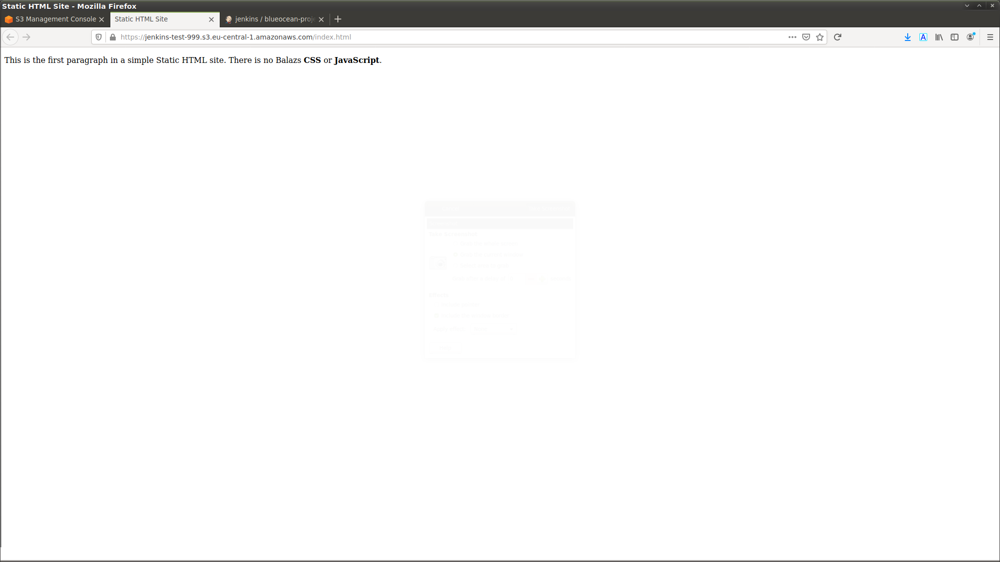

7. Linting fail 

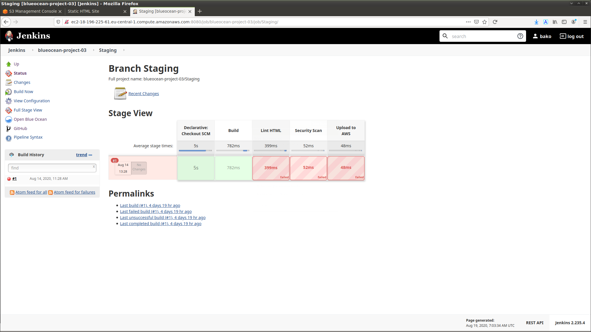

7. multistage and their state 

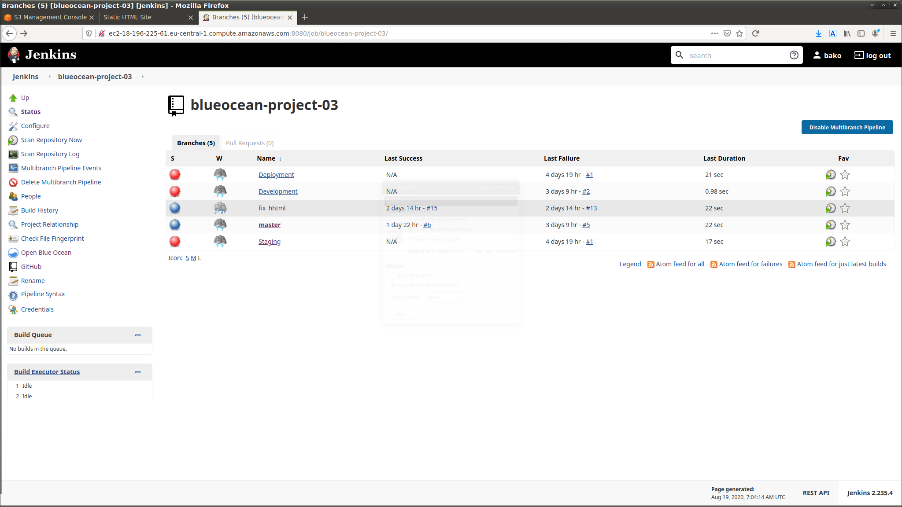

8. example of linting fix and AWS upload in the pipeline on non-master branch 

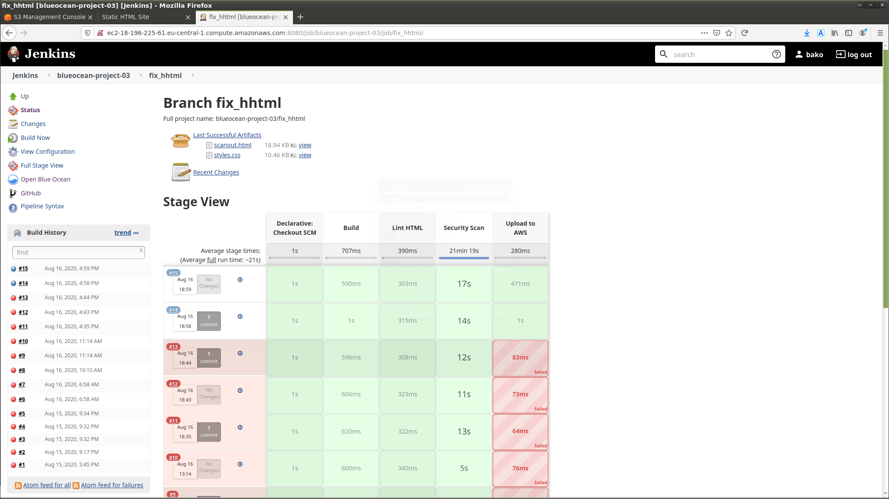
